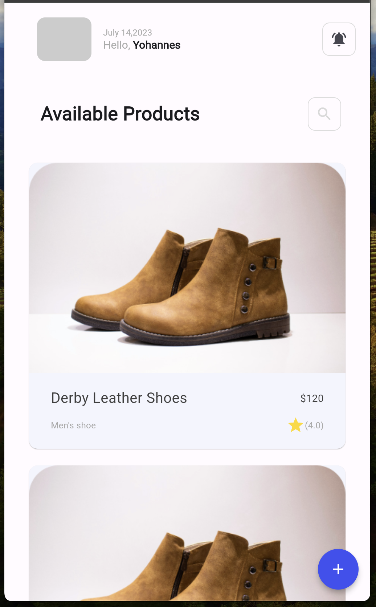
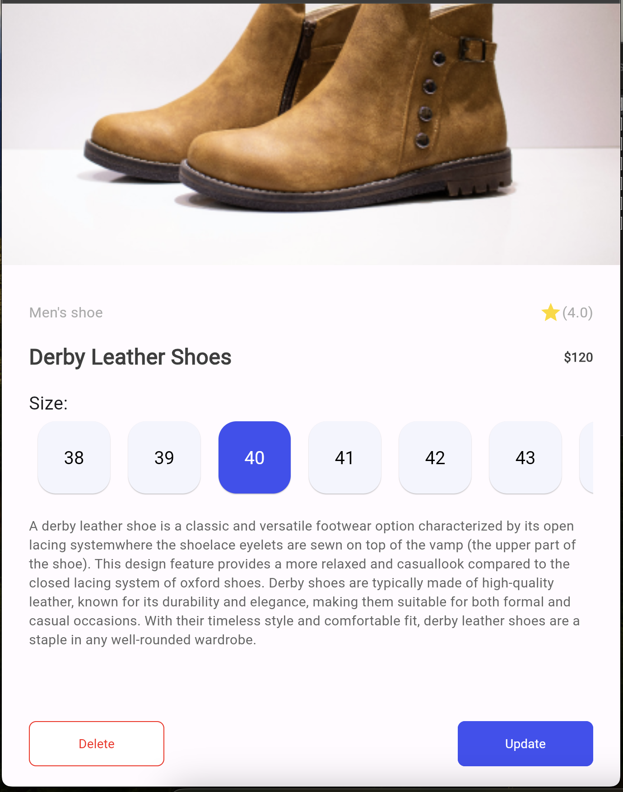
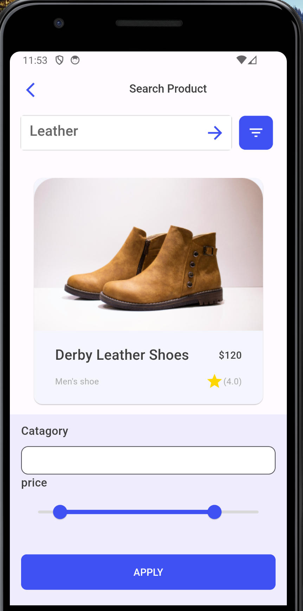
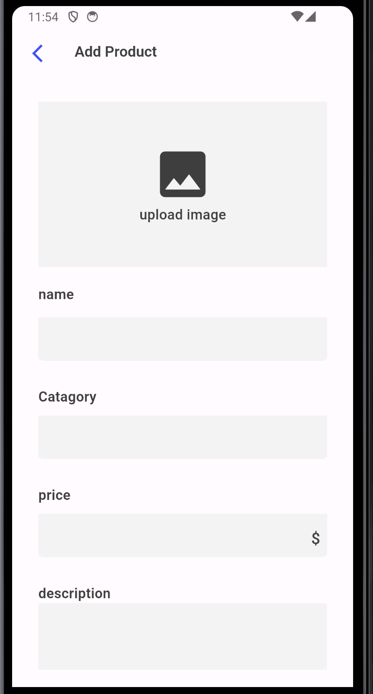
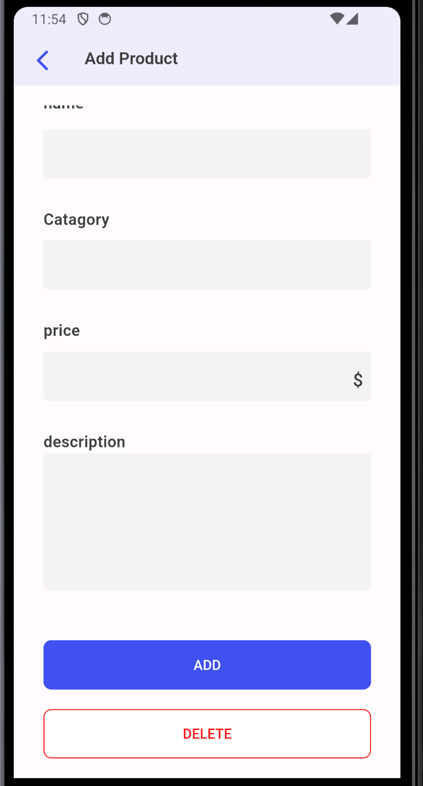

# Project Title

Task 6: Implementing a flutter UI.

## Objective

Create a Flutter user interface that replicates the design of a provided picture.
[Figma Link](https://www.figma.com/file/957Md2CrZ2B9KGjHy8RDcH/Internship?type=design&node-id=1%3A48&mode=design&t=dGzOJNr9pjkmYQog-1)

## Screenshots

Below are some screenshots of the project:

### Screen One

### Screen Two

### Screen Three

### Screen Four

  
  

